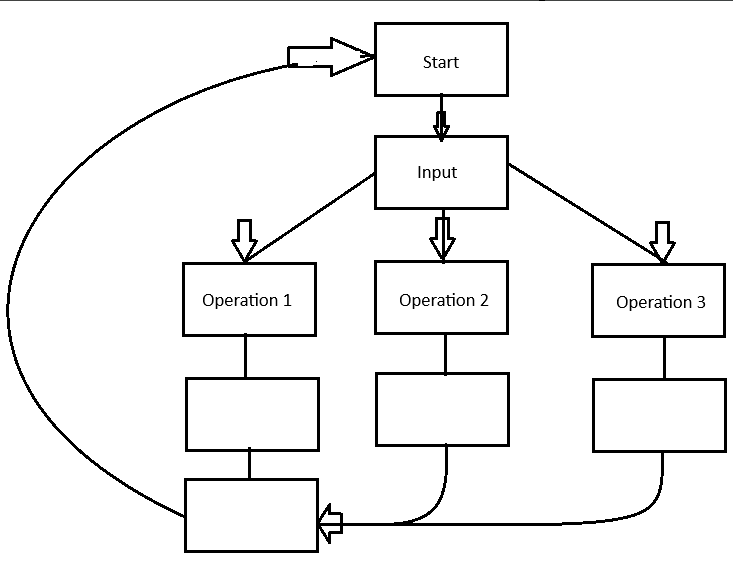
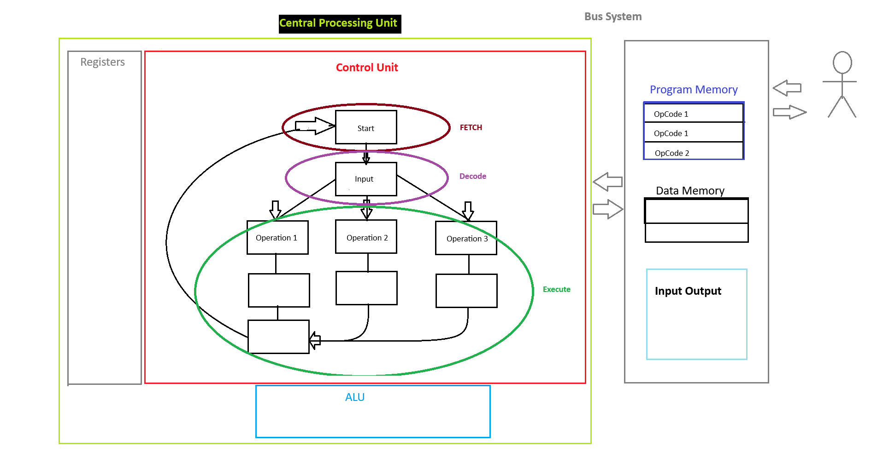

# General Overview
We have essentially two types of computers

### 1 - General Purpose Computers
- Run on Operating Systems (OS) which serves as resource manager. Able to run various softwares, designed for heavy user interaction, use peripherals like displays, keyboards, mice, wireless coms, etc. Laptops Desktops Servers Tablets Smart Phones.

### 2 - Embedded Computers (Microcontrollers (MCU))
- Designed to do one specific task. Think about a coffee maker, toasters, washer/dryer, etc. They are built with enough resource just to get the job done. These are very dedicated in terms of the way software is written to control the hardware and are for the most part designed not to have the software changed. Think about how many times you would need to update the software on your washing maching, vending machines or coffee maker. We call the software in the chip of a MCU a **FIRMWARE** because its not meant to change once software has been written to the chip and placed into the system that it controls. 

    - MCUs have something called a task schedulers where they read variety of sensors and inputs and produce the outputs. The task schedulers are called REAL TIME OPERARTING SYSTEMS (RTOS).
    - Very Common Peripherals - Timers, analog-to-digital converters, digital-to-analog converters, serial interfaces, etc. 
    - These periperals are embedded on the chip as the Central Processing Unit (CPU) in addition to all the memory you need.
    - We can implement the entire embedded computer on a single circuit making it versitile.

## 3.1 What is a computer
A collection of hardware and software that are working together to accomplish a task

Above we have a **Finite State Machine** (FSM Diagram) where when given an input, it can perform 3 types of operations. We can call the input code **operations code or OpCode (instructions)** for short. So OpCode 1 would represent some input that executed operation 1. This works great however a more practical option would be capturing the input in some sort of storage where instead of waiting for an input state, you can provide multiple inputs and those instructions will execute one by one.

| OpCode # | Side Note |
| --- | --- |
| OpCode 1 | 1's 0's in memory that tell machine which opcode to execute|
| OpCode 1 | You can enter or change the OpCode in the storage |
| OpCode 2 | |
| OpCode 1 | |
| OpCode 3 | |

So in this case SOFTWARE is the sequence of instructions the hardware will execute = Computer
The NUMBER OF INSTRUCTIONS the computer is designed to execute is called **INSTRUCTION SET**
Side Note - A register is also memory but its stored inside the CPU vs memory like RAM which is external. So these OpCodes aren't in registers.

## 3.2 Computer Hardware
Control Unit - Knows how to fetch, decode, and execute data. Fetch is what gets the operation code from the **PROGRAM MEMORY** and then decode is what interprets the instruction and picks the operation path to execute 

