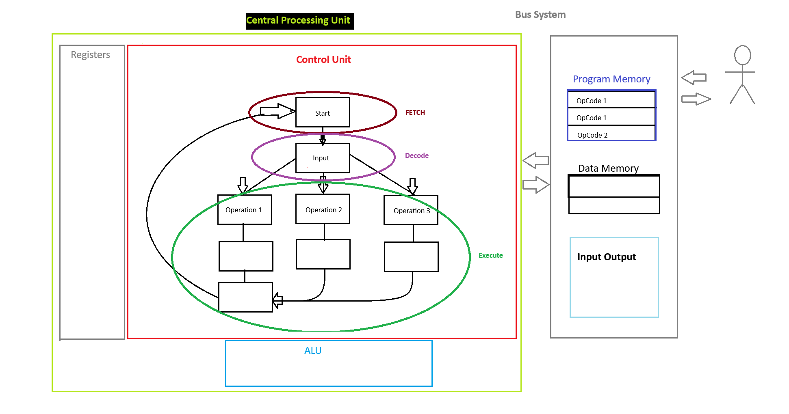

# General Overview
We have essentially two types of computers

### 1 - General Purpose Computers
- Run on Operating Systems (OS) which serves as resource manager. Able to run various softwares, designed for heavy user interaction, use peripherals like displays, keyboards, mice, wireless coms, etc. Laptops Desktops Servers Tablets Smart Phones.

### 2 - Embedded Computers (Microcontrollers (MCU))
- Designed to do one specific task. Think about a coffee maker, toasters, washer/dryer, etc. They are built with enough resource just to get the job done. These are very dedicated in terms of the way software is written to control the hardware and are for the most part designed not to have the software changed. Think about how many times you would need to update the software on your washing maching, vending machines or coffee maker. We call the software in the chip of a MCU a **FIRMWARE** because its not meant to change once software has been written to the chip and placed into the system that it controls. 

    - MCUs have something called a task schedulers where they read variety of sensors and inputs and produce the outputs. The task schedulers are called REAL TIME OPERARTING SYSTEMS (RTOS).
    - Very Common Peripherals - Timers, analog-to-digital converters, digital-to-analog converters, serial interfaces, etc. 
    - These periperals are embedded on the chip as the Central Processing Unit (CPU) in addition to all the memory you need.
    - We can implement the entire embedded computer on a single circuit making it versitile.

## 3.1 What is a computer
A collection of hardware and software that are working together to accomplish a task

Above we have a **Finite State Machine** (FSM Diagram) where when given an input, it can perform 3 types of operations. We can call the input code **operations code or OpCode (instructions)** for short. So OpCode 1 would represent some input that executed operation 1. This works great however a more practical option would be capturing the input in some sort of storage where instead of waiting for an input state, you can provide multiple inputs and those instructions will execute one by one.

| OpCode # | Side Note |
| --- | --- |
| OpCode 1 | 1's 0's in memory that tell machine which opcode to execute|
| OpCode 1 | You can enter or change the OpCode in the storage |
| OpCode 2 | |
| OpCode 1 | |
| OpCode 3 | |

So in this case SOFTWARE is the sequence of instructions the hardware will execute = Computer
The NUMBER OF INSTRUCTIONS the computer is designed to execute is called **INSTRUCTION SET**

Side Note - A register is also memory but its stored inside the CPU vs memory like RAM which is external. So these OpCodes aren't in registers. RAMs are **DATA MEMORY** or places where you can temporary store data

## 3.2 Computer Hardware
**Control Unit** Knows how to fetch, decode, and execute data. Fetch is what gets the operation code from the **PROGRAM MEMORY** and then decode is what interprets the instruction and picks the operation path to execute 

Data Memory are things like RAMs where you can temporary store data

**Registers** are fast storage inside the Control Unit. They are synchronus and they have enables so you can control when information can be stored and when they cannot. Some of these registers are going to be dedicated and some of them are going to be general purpose. FSM cannot store numbers or store information. So thats where registers come in. If we needed to add numbers, we would need to store the numbers in register temporarily

**Arithmetic Logic Unit (ALU)** - All the combinational logic that we put into our computer that perform all the operations we want. We can do plus minus ands ors etc. So any instruction logic has to be implemented in combinational logic within the ALU block. 

The way it works is that the Control Unit will know and configure the ALU to get ready for its operations and it will know what to do with the results. The ALU will operate on Registers most of the time.

Example, instruction states to add two integers. The two int values will be stored in the registers, the ALU will perform the arithmetic and store the result in a different register for Control Unit to use 

**Bus Systems**
How these components talk to each other. The Inout and Output component is for the user to interact with the computer.

### Summary
Program memory (non-volatile) will hold OpCode but also, additional information needed by the instruction. You treat this as read only memory. Programs stored on non-volatile memory, so the computer system does not lose its program when power is removed.

Data Memory (volatile - read-write memory) hold temporary variables that are created by the software program. can be written to and read from during normal operations. 

CPU - 3 sub systems 1. Registers 2. Arithmetic/Logic Unit ALU 3. Control Unit
Control Unit - Fetch -> Decode - Execute. This cycle continues over and over again
Registers - Dedicated registers and General purpose registers
    - Program Counter - Holds the address of the next instruction in program memory to execute
    - Stack Pointer - Way to allocate memory dynamically without having to keep track of specific address
    - Status Register - Contains flags that are asserted when various conditions occur during the execution of program
    - Instruction Register - holds the OpCode that is fetched from program
    - General purpose

ALU - The system that performs all mathematical and logic operations. Contains the logic to produce status bits

I/O Ports - Access the outside world, can be input output or bidirectional. Parallel ports - pass data as a bus and allow more information to be transferred per instruction. Serial Ports - use a single line and send data bit by bit

Bus System - Handles routing of signals between cpu and memory. I/O ports, data memory, and program memory share the address and data busses
    - Memory Address Bus (MAB) - provides a single address to data memory, program memory, and the I/O ports.
    - Memory Data Bus (MDB) - Carries information back and forth between the CPU and the memory & I/O ports
    - Memory Map - gives all the addresses for all locations in memory. So Data Memory, Program Memory, and I/O ports are assigned a unique address

## 3.3 Computer Software
We have a CPU that has a set of instructions that it knows how to execute. Things like the number of instructions it can execute, the memory size, etc is decided by the designer

The set of instructions that a particular hardware can execute is called **Instruction Set**. Remember that the hardware is designed before hand, so you make the CPU, you make the micro-controller then you sell it. The person who buys the micro-controller writes the software for it. Intel, Texas Instrument, decide which instruction its going to execute. 

RISC - Reduced Instruction Set Computer - Small number of instructions
CISC - Complex Instruction Set Computer - Large number of instructions

In the image below, a RISC architecture you will have very few instruction path and smaller list of codes where as the CISC would have a lot more instruction paths with longer set of instruction codes.  

Because RISC is fewer instructions it requires sometimes a larger number of operations to do something more complex where CISC is already complex and requires fewer instructions. However if the task is simple then the RISC architecture tends to have the advantage

### Classes of Instructions

**Data Movement** - Moving information between the CPU(Registers) and memory region or between two memory locations. Memory Region includes Data Memory, Program Memory, AND I/O Ports. 

Remember that Memory Regions contain addresses and so the Data Movement Instructions might be moving say constants from Program Memory to Registers, or maybe theres something in the Data Memory the register needs or you might read from the port and place it in the registers. This data movement works vice versa.

You're always moving back and forth from CPU(Registers) and Memory Region because Control Unit doesn't have storage, and neither does the ALU.

**Data Manipulation**
Use the ALU to perform arithmetic or logical operations on information. So in general, if you want to mess with data from the Data Memory, you would need to move the data from Data Memory to the Registers and the the ALU will manipulate the data and put it back into the register and then maybe move the data from the register to the I/O Port or something
EXAMPLE: Addition, Subtractions, ANDs, XORs, Increments, Decrements, Bit-Sets, Bit-Clears

**Program Flow Instructions**
When you are reading OpCode from the Program Memory so reading code from say address 8000 then 8001 and 8002 (Remember reading is data moving from program memory to the register) you will eventually need to go back to the top of the address because micro-controllers run forever and in a loop so then what makes program jump back to the top. Thats when program flow instructions come in. Program Flow Instruction is the ability to alter the program counter to support looping and conditional statement functionality

Unconditional Program Flow - always change the program counter to a fixed value

Conditional Program Flow - only alter the program counter when certain conditions exist within the status register. This should sound familiar if you experience programming assembly. Literally do some condition, if the condition matches, set a flag, and if that flag is set then jump to a different point in address or whatever

### OP CODES
Unique binary code given to each instruction in the set.

**Mnemonic** Descriptive name for the op-code that can be used when discussing the instruction functionality. So addition will have a mnemonic... ADD

**Assembly** low-level language that uses mnemonics to communicate which instruction is being talked about

**Assembler** translates mnemonics and additional information for each instruction into its specific op-code

### Compiler
At the highest level of program development, the language C can be used to develop programs without needing to understand the architecture of the CPU or how the internal registers are used to move and manipulate data.

**Compiler** used to convert high-level programming constructs into individual assembly language instructions.

**Assembler** used to translate the instructions mnemonics and operands into their corresponding binary codes

**Linker** A tool withing the development flow that joins multiple source files and assigns the final addresses for the program code. The output of the linker stage is an **EXECUTABLE OBJECT FILE** which is a binary file, ready to be downloaded to the micro-controller using the EEPROM programmer. With an executable object file you can attach a debugger and follow instructions step by step.

In the image below, the MSP430 is a micro-controller

