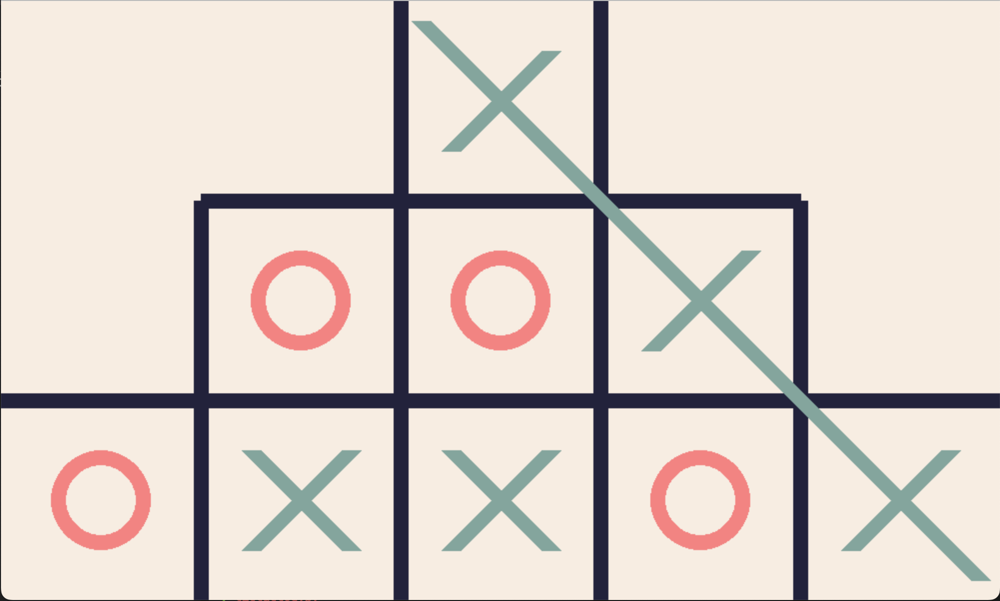

# CPSC 481 Tic-Tac-Toe Pyramid Project

## Description
We created Tic Tac Toe game with a graphical user interface that allows any one player to challenge themselves against the AI player. Moreover, instead of the traditional 3*3 grid game board shape, we will be using a pyramid shaped grid.
## Collaborators
Jin Lu 
Pawan Chandra 
Suhyr Hasan
## How to Play
To clone repository run the following command in your terminal:
```
git clone 

```
To run the program run the following command in your terminal:
```
python3 tictactoe.py
```
## Example 
